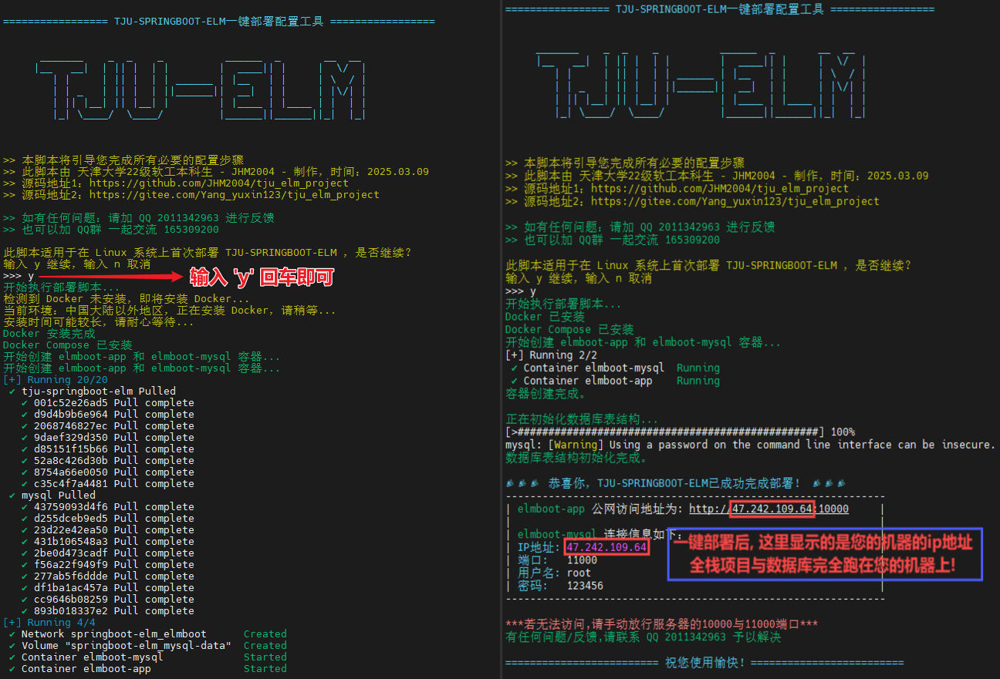
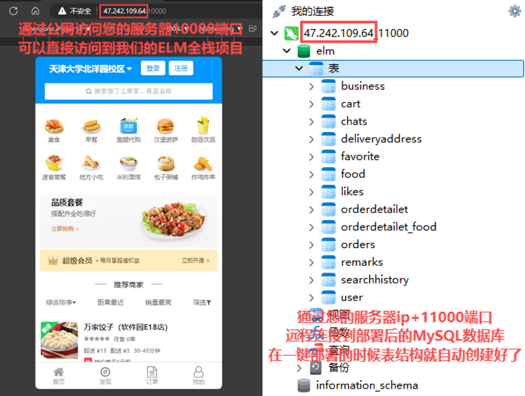
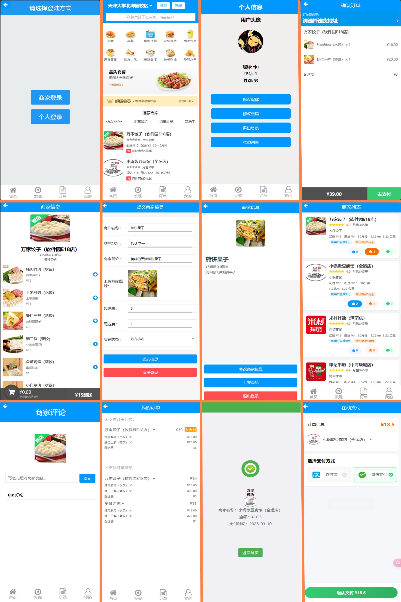

# 天津大学软件工程综合实践-elm外卖平台项目

## 1. 本项目在linux机器上一键部署

### 1.1 一键部署命令

```shell
sudo curl -fsSL -o ~/deploy.sh https://www.yangyuxin.cn/elm/boot/deploy.sh && sudo curl -fsSL -o ~/elm.sql https://www.yangyuxin.cn/elm/boot/elm.sql && sudo curl -fsSL -o ~/docker-compose.yaml https://www.yangyuxin.cn/elm/boot/docker-compose.yaml && sudo chmod +x ~/deploy.sh && sudo bash ~/deploy.sh
```

### 1.2 操作演示

#### 在一台新的linux机器(内存需要2G)上执行一键部署命令(这里推荐使用非大陆服务器，访问DOCKER更快。如果是大陆服务器访问DOCKER，运行我的一键部署脚本会自动配置加速镜像，但访问速度仍稍慢些)



#### 部署后可以直接

#### ① 通过您的服务器的公网ip+10000端口访问到我们的ELM全栈项目

#### ② 通过您的服务器ip+11000端口，远程连接到部署后的MySQL数据库，在一键部署的时候表结构就自动创建好了



### 1.3 项目总效果图



### 1.4 总结

#### 在Linux机器上运行一键部署命令后，可以直接：

#### 通过`http://您的主机ip:/10000`访问到`TJU-ELM`项目网站首页；

#### 通过`您的主机ip + 11000端口 + 账号root + 密码123456`远程连接到`TJU-ELM`项目数据库MySQL；

### 1.5 问题反馈渠道

### 项目反馈：

#### 您可以通过提交 [Issue](https://github.com/JHM2004/tju_elm_project/issues) 反馈包括但不限于以下内容：  

- 项目功能建议  

- 系统问题报告  

- Bug 提交

### 遇见任何问题可以联系:

#### QQ 2011342963

#### QQ群 165309200

---

## 2. Windows本机启动项目

### 2.1 数据库MySQL启动

#### 在MySQL中创建elm数据库, 找到elmboot文件夹中的elm.sql脚本, 在elm数据库中执行elm.sql脚本

### 2.2 后端SpringBoot启动

#### 直接使用JAVA编译器(IntelliJ IDEA 等)启动elmboot\src\main\java\com\neusoft\elmboot\ElmbootApplication.java

### 2.3 前端Vue3启动

#### ① 在elmclient目录下运行 `npm install` 安装项目依赖项

```bash
npm install
```

#### ② 在elmclient目录下运行 `npm run serve` 启动开发服务器

```bash
npm run serve
```

### 2.4 访问Local后面的端口

#### 

#### 通过 ` http://localhost:8081 ` 成功访问到ELM项目网站

<div style="display: flex; justify-content: space-between;">
  
</div>

---

## 3. 项目具体介绍

<div style="display: flex; justify-content: space-between;">
  
</div>

### 注：这个全栈项目最终使用的代码是elmclient前端+elmboot后端+elmboot-sql数据库。

### 3.1 项目一 elm_admin --- 后端JDBC版

#### elm_admin 是饿了么 **JDBC** 版项目，采用了 **JDBC+Mysql** 开发，是纯后端的字符界面操作数据库的命令行应用程序。

 **3.1.1 简介** 

 **3.1.1.1 项目技术架构** 
- JDK 1.8 
- JDBC 
- MySQL 数据库

 **3.1.1.2 开发工具** 
- STS（spring-tool-suite）
- mysql-5.5.62-winx64 
- Navicat Premium 8 

 **3.1.2 安装部署指南** 
- 安装 jdk、STS、MySql
- 在 mysql 数据库中创建数据库 elm_admin，使用数据库脚本
elm_admin.sql 创建数据库和初始数据。
- 在 STS 中导入 javaSE 项目。
- 打开 com/neusoft/elm/util/DBUtil 修改数据库密码
- 本项目有两个入口：管理员入口、商家入口。
  - 运行 ElmAdminEntry 中的 main 函数为管理员入口。
  - 运行 ElmBusinessEntry 中的 main 函数为商家入口。

 **3.1.3 整体要求**  

 **3.1.3.1 项目技术架构** 

 - JDK8 

 - JDBC 

 - MySql 

 **3.1.3.2 开发工具** 

 - STS（SpringToolSuite4）

 - mysql-5.5.62-winx64 

 - navicat 

 **3.1.3.3 涉及的技术点** 

 - 封装 JDBC 

 - 封装 DAO

 - 领域模型中的实体类

 - 增删改查操

 - 多条件模糊查询

 - JDBC 事务管理

 - 表的主外键关系


### 3.2 项目二 elm_demo --- html css js 前端搭建

#### 饿了么前端版项目是采用 **HTML、CSS、JavaScript** 开发的前端静态网页项目。

 **3.2.1 简介** 

 **3.2.1.1 项目前端技术架构：** 
- HTML 
- CSS 
- JavaScript

 **3.2.1.2 开发工具** 
- hbuilder 
- chrome 浏览器

 **3.2.2 安装部署指南** 
- 安装 hbuilder、chrome
- 将工程导入到 hbuilder 中
- 在 chrome 浏览器中运行 index.html 文件
- 在 chrome 浏览器中使用 Toggle device toolbar 模拟手机浏览

 **3.2.3 整体要求** 

 **3.2.3.1 项目技术架构** 

- HTML5 

- CSS3 

- JavaScript（ES6 以上）

 **3.2.3.2 开发工具** 

- Hbuilder 

- Chrome 浏览器

 **3.2.3.3 涉及的技术点** 

- HTML5 标签的使用

- CSS3 样式的使用

- JS 对 DOM 的基本操作

- DIV+CSS 布局基础

- 移动端布局基础

- viewport 设置

- 弹性布局

- 边框盒子模型

- vw 与 vh 的使用

- 图片按比例自适应

- CSS3 小图标的使用

- 第三方字体库的使用


### 3.3 项目三 elmclient --- 前端升级为Vue3框架

 **3.3.1 项目概述** 

 **3.3.1.1 项目演示** 

- 运行 “饿了么项目” ，演示应用程序效果，演示 “点餐业务线” 整体流程。
- 本项目参照 “饿了么官网网页版”制作。
- 本项目专注于完成点餐业务线功能， ”饿了么官网“中的其它功能暂不涉及 。

 **3.3.1.2 项目目标** 
- 本项目为课程级贯穿项目中的第三个项目（JDBC项目、前端项目、javaWeb项目）。
- 本项目完成后，学员将能够使用VUE+Servlet+A JAX技术开发前后端分离的Web应用程序。

 **3.3.1.3 项目中所涉及到相关知识点** 

- AJAX的使用
- Servlet的使用
- Session的使用
- 简单MVC封装
- Service层事务管理
- dao层批量操作
- 多对一与一对多的映射
- 服务器端json数据转换
- VueCli的使用
- 多条件模糊查询的使用
- Svn、Git版本控制工具的使用

 **3.3.1.4 数据库设计** 

 **本项目完成后，学员将能够使用VUE+Servlet+AJAX技术开发前后端分离的Web应用程序。** 

 **3.3.2 整体要求**  

 **3.3.2.1 项目技术架构** 

- Jdk8 

- Servlet 

- Tomcat5.5 

- MySql 

- Vue 

 **3.3.2.2 开发工具** 

- Hbuilder 

- STS（SpringToolSuite4）

- mysql-5.5.62-winx64 

- Tomcat8.5 

 **3.3.2.3 涉及的技术点** 

- AJAX 的使用

- Servlet 的使用

- Session 的使用

- 简单 MVC 封装

- Service 层事务管理

- dao 层批量操作

- 多对一与一对多的映射

- 服务器端 json 数据转换

- VueCli 的使用

- 多条件模糊查询的使用


### 3.4 项目四 elmboot --- 后端升级为SpringBoot框架

#### 3.4.1 整体要求

 **3.4.1.1 项目技术架构** 

- Jdk8 

- SpringBoot 

- MyBatis 

- MySql 

- Vue 

 **3.4.1.2 开发工具** 

- Hbuilder 

- STS（SpringToolSuite4）

- mysql-5.5.62-winx64 

- Tomcat8.5 

- Maven 

 **3.4.1.3 涉及的技术点** 

- AJAX 的使用

- SpringBoot 框架的使用

- MyBatis 框架的使用

- 封装 Mapper 

- Service 层事务管理

- 数据层层批量操作

- 多对一与一对多的映射

- 服务器端 json 数据转换

- VueCli 的使用

- 多条件模糊查询的使用

## 4. 贡献指南

- **问题反馈**：若发现脚本失效、功能异常或其他技术问题，请通过提交 [Issue](https://github.com/JHM2004/tju_elm_project/issues) 及时告知  
- **建议与优化**：对于项目改进建议或 Bug 报告，亦可通过 [Issue](https://github.com/JHM2004/tju_elm_project/issues) 渠道反馈  
- **代码贡献**：  
  1. 请先 Fork 本项目至您的个人仓库  
  2. 完成代码修改后，通过提交 [Pull Request](https://github.com/JHM2004/tju_elm_project/pulls) 参与贡献
 
## 5. 技术支持渠道

如您在使用过程中遇到任何问题，可通过以下途径获取支持：  
- **技术支持QQ**：2011342963  
- **用户交流QQ群**：165309200  
